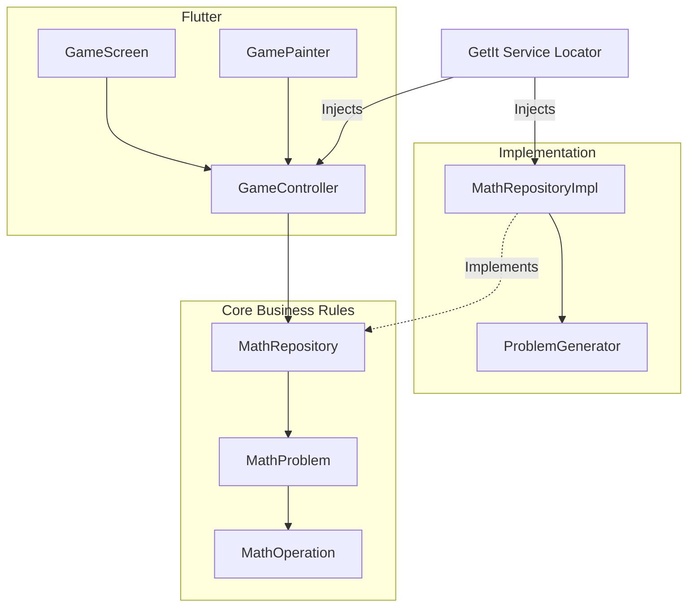

# Diseño de Software y Especificaciones Visuales: Math Army

Este documento unifica el diseño de la arquitectura del software (Clean Architecture) y el sistema de diseño visual (Tokens y Componentes) compatible con Figma y **Stitch** (Project ID: `1698190024553260247`, Asset ID: `0f381c9721b340b1bf7a27d1e3c45704`).

---

## 1. Arquitectura del Sistema (Clean Architecture)

El proyecto separa las reglas de negocio (módulo matemático) de la implementación visual (Flutter Canvas y CustomPainter) para garantizar mantenibilidad.

### Capas del Proyecto
*   **Domain (Dominio)**: Entidades puras Dart 
[MathOperation](/math-army/lib/features/math_engine/domain/entities/math_operation.dart), [MathProblem](/math-army/lib/features/math_engine/domain/entities/math_problem.dart) y firma del repositorio ([MathRepository](/math-army/lib/features/math_engine/domain/repositories/math_repository.dart)).
*   **Data (Datos)**: Implementación ([MathRepositoryImpl](/math-army/lib/features/math_engine/data/repositories/math_repository_impl.dart)) y el generador de problemas ([ProblemGenerator](///Users/nestorariascataldi/Projects/math-army/lib/features/math_engine/data/data_sources/problem_generator.dart)).
*   **Presentation (Presentación)**: Controlador reactivo ([GameController](/Users/nestorariascataldi/Projects/math-army/lib/features/game/presentation/controllers/game_controller.dart)), widgets ([GameScreen](/Users/nestorariascataldi/Projects/math-army/lib/features/game/presentation/pages/game_screen.dart)) y el renderizador ([GamePainter](/Users/nestorariascataldi/Projects/math-army/lib/features/game/presentation/widgets/game_painter.dart)).

---

## 2. Tokens de Diseño (Design Tokens - Stitch Linkage)

### Colores (Color Palette)
*   **Fondo Principal (Background)**: `#0B0F19` (Space Cadet - Azul ultra oscuro)
*   **Contenedores e Interfaces (Surface)**: `#1E293B` (Slate Blue)
*   **Aliados y Héroe (Primary)**: `#00E5FF` (Neon Cyan)
*   **Acierto / Éxito (Success)**: `#39FF14` (Neon Green)
*   **Error / Enemigo (Danger)**: `#FF3131` (Neon Red)
*   **Jefe Final (Warning)**: `#FF5F1F` (Neon Orange)
*   **Texto Principal**: `#F8FAFC` (Blanco brillante)

### Tipografía (Typography)
*   **Títulos e Indicadores**: `Outfit` (Sans-serif con resplandor neón).
*   **Cuerpo de Texto**: `Plus Jakarta Sans` (Legibilidad premium).

---

## 3. Lógica del Juego y Física del Runner

### A. Algoritmo del ProblemGenerator (Garantía >= 70)
Para asegurar el desafío matemático pedagógico:
*   Se calcula una secuencia de portales cuya resolución óptima asegura llegar al final con $\ge 70$ soldados.
*   Tomar **una sola decisión incorrecta** penaliza con restas o divisiones de tal magnitud que el total final queda en $< 70$, haciendo imposible derrotar al jefe.

### B. Formación Concéntrica del Ejército
En el `GameController`, los soldados se distribuyen en capas concéntricas alrededor de Leo. Para dar dinamismo visual, los soldados lerpean suavemente hacia sus coordenadas objetivo y oscilan verticalmente de forma sinusoidal simulando el movimiento de correr.

### C. Regla de Portales Ciegos (Diseño UX)
Para forzar al niño a resolver mentalmente, ambos portales en el CustomPainter se renderizan en color **cian neón neutro** antes de cruzarse. Al rebasar la línea de Leo, se revela mediante sonido y color (verde/rojo) el resultado de la colisión.

---

## 4. Especificación de Pantallas en la Nube (Stitch)

*   **WelcomeScreen**: Pantalla de inicio con el título en grande "MATH ARMY" y tarjeta informativa de misión.
*   **GamePlayScreen**: HUD superior con nivel, botones rápidos e indicador de progreso. Contiene la pista y al ejército de Leo avanzando hacia el jefe final.
*   **VictoryScreen**: Pantalla de éxito con trofeo en verde neón y botón de avance de nivel.
*   **DefeatScreen**: Pantalla de fallo en rojo neón con tips de ayuda pedagógica y botón de reintentar.
